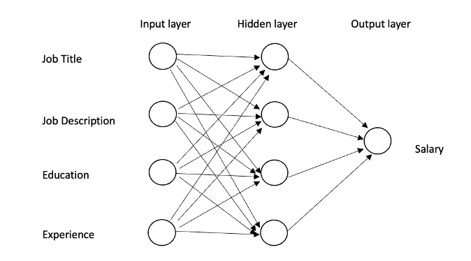

## Salary Prediction using Neural Networks

## Methodology: 


### A. Analysis
State space formulation: 
<br>
The state space formulation involves defining the variables that affect salary prediction. The variables used in this study include job title, education, experience.
<br>
State transition function: The state transition function involves defining the relationship between the variables in the state space. In this study, a feedforward neural network is used as the state transition function. The neural network is trained using the dataset to predict salaries based on the defined variables.
<br>
Evaluation function: The evaluation function involves evaluating the performance of the neural network in predicting salaries. The performance of the neural network is evaluated using various metrics such as mean squared error (MSE), root mean squared error (RMSE), and mean absolute error (MAE).
Observable: The state space formulation is partially observable, as some information may not be available or difficult to measure like the job description.
<br>
Agents: It is a single-agent system, as the neural network model is the only decision-making entity involved in the prediction of salaries.
Nature: The system is deterministic, as the state transition function is fixed and produces the same output for a given input.
<br>
Experience: The system is sequential, as the state of the system evolves over time, with more experience, education levels or job title changes.
<br>
Environment Change: The system is dynamic, as it keeps learning and training itself, the state of the system evolves over time.
<br>
Percepts and actions set: The variables in the state space are mostly discrete like job title, education level while some may be continuous like experience in years.
<br>
<br>

### B. Neural Network Model
The neural network model consists of multiple layers including an input layer, several hidden layers, and an output layer.
<br>
i) Input Layer: The input layer receives the preprocessed data, and each neuron in the
input layer represents a specific feature of the job position such as job title, experience,
education.
<br>
ii) Hidden Layers: The hidden layers contain a varying number of neurons, with the number
determined through experimentation and optimization. Each neuron in the hidden layer is connected to every neuron in the previous layer, and each connection is assigned a weight value that determines the strength of the connection. The activation function used for the hidden layers is the rectified linear unit (ReLU) function.
<br>
iii) Output Layer: The output layer of the neural network consists of a single neuron that represents the predicted salary of the job position. The activation function used for the output layer is the linear function, which allows the output to take on any real value.
During the training process, the model uses the backpropagation algorithm to adjust the weights of the connections between neurons to minimize the difference between the predicted salary and the actual salary.
The model's performance is evaluated using metrics such as mean squared error (MSE) on a validation set. Once the model is trained and validated, it can be used to predict salaries for new job positions based on the selected features.




#### C. Dataset:

To build a neural network model that can predict accurate salaries for candidates based on various inputs like job experience, skillset, knowledge, and so on, we will need a dataset that contains relevant information about different job postings and their corresponding salaries. We can extract this information using web scraping techniques with Python and libraries like Selenium.
To do this, we can use job search websites like Indeed or Glassdoor to extract data fields like job title, job salary, job skillset, job qualification, job experience, and other relevant information about different job positions. Once we extract this information, we store it in a structured format like a CSV file or a database.

## Results

```
Mean absolute error: 56.86

Real 	Predicted 
80.0 	75.929039
70.0 	76.202133
87.5 	76.335106

```

